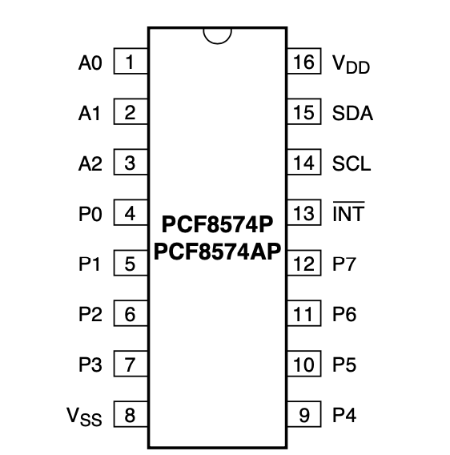
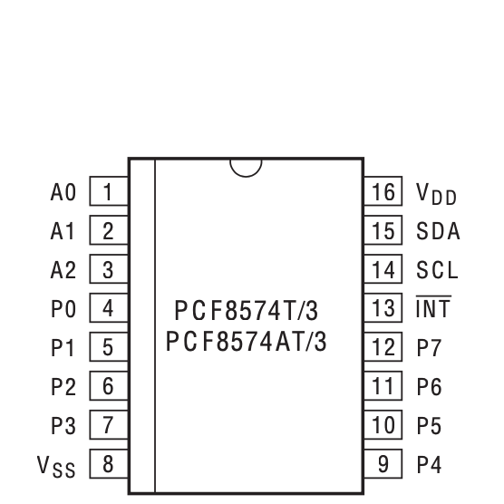
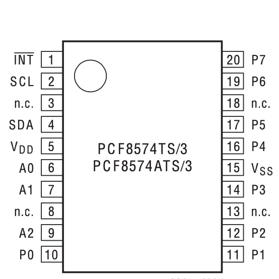
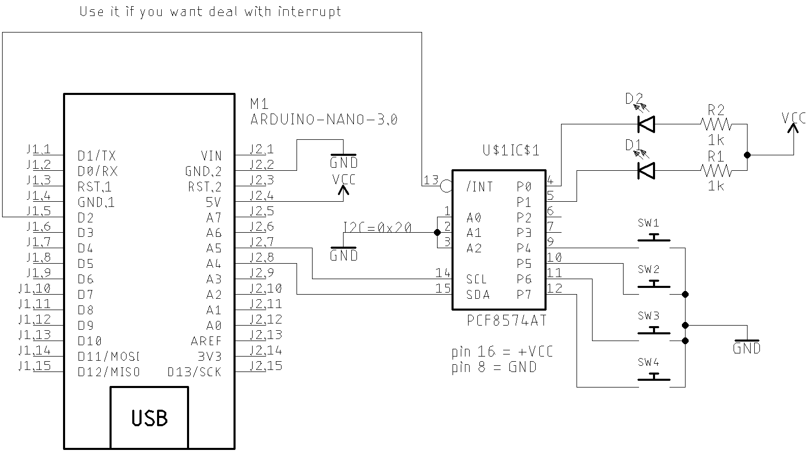
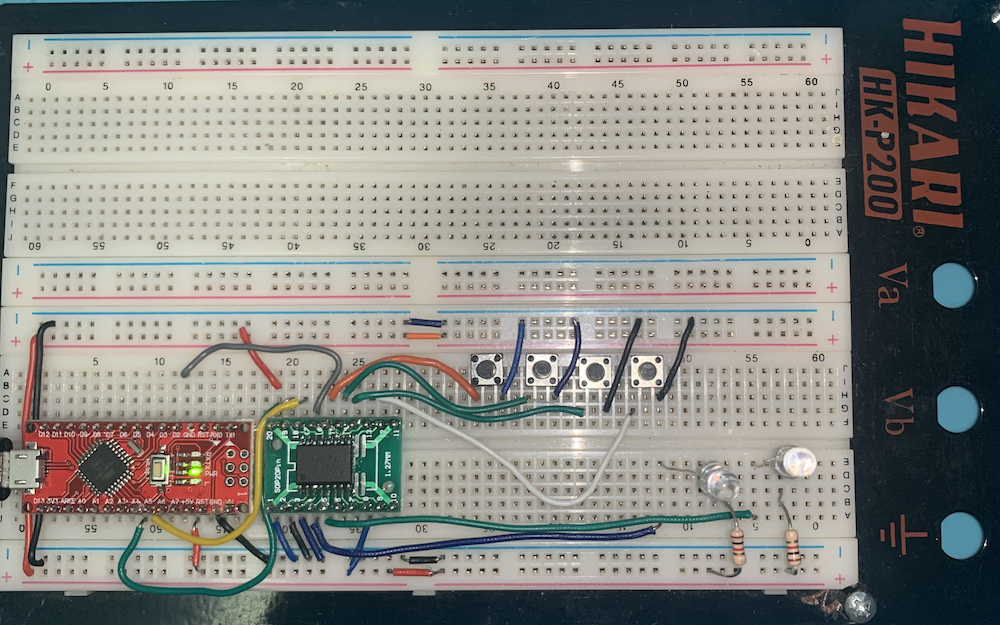

# [PU2CLR - PCF8574 Arduino Library](https://pu2clr.github.io/PCF8574/)

It is an Arduino Library to control the PCF8574 8-Bit I/O Expander. 

The PCF8574 device provides 8-bit, general purpose, parallel I/O expansion. It can be controlled via I²C bus applications. It is a great and inexpensive device that allow you to add more peripherals to be controlled by your Arduino board via I²C protocol.

Some Arduino projects may require more pins than the Arduino actually has. In these cases, you can use up to 8 PCF8574 devices using only the I²C bus (two Arduino pins) and add up to 64 input / output ports to your project. 

This Arduino implements the most important functions available on PCF8574 device  and can be freely distributed using the MIT Free Software model. See [NXP Semiconductors datasheet - PCF8574; PCF8574A - Remote 8-bit I/O expander for I2C-bus with interrupt](https://www.nxp.com/docs/en/data-sheet/PCF8574_PCF8574A.pdf) for more information about the PCF8574 device.

[Copyright (c) 2021 Ricardo Lima Caratti](https://pu2clr.github.io/PCF8574/#mit-license). 

## Donate 

[If you find this project useful, consider making a donation so that the author of this library can purchase components and modules for improvements and testing of this library. Click here to donate.](https://www.paypal.com/donate/?business=LLV4PHKTXC4JW&no_recurring=0&item_name=Consider+making+a+donation.++So+I+can+purchase+components+and+modules+for+improvements+and+testing+of+this+library.&currency_code=USD)

## Contents

1. [License Copyright](https://pu2clr.github.io/PCF8574/#mit-license)
2. [Thanks](https://pu2clr.github.io/PCF8574/#thanks)
3. [Labrary Features](https://pu2clr.github.io/PCF8574/#labrary-features)
4. [Library Installation](https://pu2clr.github.io/PCF8574/#library-installation)
5. [Other Arduino Libraries developed by the Author](https://pu2clr.github.io/PCF8574/)
6. [API documentation](https://pu2clr.github.io/PCF8574/extras/apidoc/html/)
7. [Basic Schematic](https://pu2clr.github.io/PCF8574/#basic-schematic)
8. [Internal Interrupt setup](https://pu2clr.github.io/PCF8574/#internal-interrupt-setup) 
9.  [PCF8574 reset control](https://pu2clr.github.io/PCF8574/#PCF8574-reset-control)
10. [References](https://pu2clr.github.io/PCF8574/#references)

## MIT License 

Copyright (c) 2019 Ricardo Lima Caratti

Permission is hereby granted, free of charge, to any person obtaining a copy of this software and associated documentation files (the "Software"), to deal in the Software without restriction, including without limitation the rights to use, copy, modify, merge, publish, distribute, sublicense, and/or sell copies of the Software, and to permit persons to whom the Software is furnished to do so, subject to the following conditions:

The above copyright notice and this permission notice shall be included in all copies or substantial portions of the Software.

THE SOFTWARE IS PROVIDED "AS IS", WITHOUT WARRANTY OF ANY KIND, EXPRESS OR IMPLIED, INCLUDING BUT NOT LIMITED TO THE ARRANTIES OF MERCHANTABILITY, FITNESS FOR A PARTICULAR PURPOSE AND NONINFRINGEMENT. IN NO EVENT SHALL THE AUTHORS OR COPYRIGHT HOLDERS BE LIABLE FOR ANY CLAIM, DAMAGES OR OTHER LIABILITY, WHETHER IN AN ACTION OF CONTRACT, TORT OR OTHERWISE, ARISING FROM, OUT OF OR IN CONNECTION WITH THE SOFTWARE OR THE USE OR OTHER DEALINGS IN THE SOFTWARE.

## Thanks

## Labrary Features

This library uses the I²C communication protocol and implements most important functions offered by PCF8574 device from MicroChip. It also has primitive functions that make it easier to implement commands that may not have been implemented yet. The main features implemented can be seen below:

* GPIO/PORT individual control (8 I/O pins)
* I²C address customization (from 0x20 to 0x27)
* Internal Interrupt feature setup

## Demo video 



[See on Youtube](https://youtu.be/KaKorRy0hUI)
 

## Library Installation

__Under construction..__ 

You can install this library on your Arduino environment using different methods. The best ways to do that are described below.  

### Installing via Arduino IDE

This is the easiest method to install this library.

On Arduino IDE, select the __"Manager Libraries..."__ item and look for PCF8574. Finally select "PU2CLR PCF8574". 

#### More information

See also [Installing an Arduino Library ](https://learn.sparkfun.com/tutorials/installing-an-arduino-library/using-the-arduino-library-manager)

### Installing via this repository 

First, you have to [download](https://github.com/pu2clr/PCF8574/archive/main.zip) this library in zip format. 
After, unzip the PCF8574-master.zip file in your Arduino Library folder. 

* On __Windows__: "My Documents\Arduino\libraries"
* On __MAC OS__: ˜/Documents/Arduino/libraries
* On __Linux__: ˜/Documents/Arduino/libraries

With that approach, you will have the __most current version__ of the library. However, __it may not be the most stable version__. This is because the current version is always in development. [Prefer releases](https://github.com/pu2clr/PCF8574/releases).
Do you need some old version (release) of this library?  If yes, [check here](https://github.com/pu2clr/PCF8574/releases). 

## Other Arduino Libraries developed by the Author

* [PU2CLR Si4735 Library for Arduino](https://pu2clr.github.io/SI4735/). This library was built based on “Si47XX PROGRAMMING GUIDE; AN332” and it has support to FM, AM and SSB modes (LW, MW and SW). It also can be used on all members of the SI47XX family respecting, of course, the features available for each IC version;
* [PU2CLR SI4844 Arduino Library](https://github.com/pu2clr/SI4844). This is an Arduino library for the SI4844, BROADCAST ANALOG TUNING DIGITAL DISPLAY AM/FM/SW RADIO RECEIVER,  IC from Silicon Labs.  It is available on Arduino IDE. This library is intended to provide an easier interface for controlling the SI4844.
* [PU2CLR AKC695X Arduino Library](https://pu2clr.github.io/AKC695X/). The AKC695X is a family of IC DSP receiver from AKC technology. The AKC6955 and AKC6959sx support AM and FM modes. On AM mode the AKC6955 and AKC6959sx work on LW, MW and SW. On FM mode they work from 64MHz to 222MHz.
* [PU2CLR KT0915 Arduino Library](https://pu2clr.github.io/KT0915/). The KT0915 is a full band AM (LW, MW and SW) and FM DSP receiver that can provide you a easy way to build a high quality radio with low cost.
* [PU2CLR BK108X](https://pu2clr.github.io/BK108X/). The BK1086 and BK1088 are DSP receivers from BAKEN. The BK1088 is a BROADCAST FM and AM (LW, MW and ) RECEIVER and BK1086 is a subset of the BK1088 (it does not have LW and SW acording to the Datasheet).
* [PU2CLR RDA5807 Arduino Library](https://pu2clr.github.io/RDA5807/). The RDA5807 is a FM DSP integrated circuit receiver (50 to 115MHz) with low noise amplifier support. This device requires very few external components if compared with other similar devices. It also supports RDS/RBDS functionalities, direct auto gain control (AGC) and real time adaptive noise cancellation function.
* [PU2CLR SI470X Arduino Library](https://pu2clr.github.io/SI470X/). It is a Silicon Labs device family that integrates the complete functionalities for FM receivers, including RDS (Si4703).
* [PU2CLR MCP23008 Arduino Library](https://pu2clr.github.io/MCP23008/). It is an Arduino Library to control the MCP23008 8-Bit I/O Expander. The MCP23008 device provides 8-bit, general purpose, parallel I/O expansion. It can be controlled via I2C bus applications. It is a great and inexpensive device that allow you to add more devices to be controlled by your Arduino board via I2C protocol.

### More Arduino Projects developed by author 

* [Multipurpose signal generator with SI5351](https://pu2clr.github.io/SI5351/). It is a multipurpose signal generator controlled by Arduino. This project uses the SI5351 from Silicon Labs. The Arduino sketch is configured to control the SI5351 with three channels from 32.768KHz to 160MHz and steps from 1Hz to 1MHz.
* [Shortwave Arduino Transmitter](https://pu2clr.github.io/Small-Shortwave-Transmitter/). This project is about a shortwave transmitter from 3 MHz to 30 MHz. It uses the SI5351 oscillator from Silicon Labs controlled by Arduino. Also, you can use it with a crystal oscillator. In this case, you will not need the SI5351 device and Arduino. 
* [Android and iOS Bluetooth Remote Control for PU2CLR Arduino Library DSP receivers](https://pu2clr.github.io/bluetooth_remote_control/). This project is an extension of the Arduino library projects for: [SI4735](https://pu2clr.github.io/SI4735/); [AKC6959](https://pu2clr.github.io/AKC695X/) and [KT0915](https://pu2clr.github.io/KT0915/). It is a simple example that shows a way to use your smartphone as a remote control via Bluetooth. In order to follow the steps presented here, I am assuming that you have some knowledge in development for mobile devices. Also, you will need to be familiar with the Javascript programming language. The development environment used by this project is the [Apache Cordova](https://cordova.apache.org/docs/en/latest/guide/overview/index.html). Cordova is a open-source mobile development framework that allows you to develop cross-platform applications. That means you can code once and deploy the application in many system, including iOS and Android. 
Cordova provides an easy way to develop for iOS and Android.  
* [Band Pass Filter controlled by Arduino](https://pu2clr.github.io/auto_bpf_arduino/). It is a HF band pass filter controlled by Arduino. It is designed for HF receivers. With this project, you can use a set of up to four HF bandpass filters that can be selected by Arduino. To do that you will need just two digital Arduino pins.

## PCF8574 pinout 

| DIP16 |  SO16 | SSOP20 | 
| ----- | ----- | ------ | 
| |  |  | 

### The table below shows the pin descriptions used by DIP16, SO16 and SSOP20

|Pin Label | pin number (DIP16/SO16) | pin number (SSOP20) | Description |
|----------|-------------------------|---------------------|-------------|
|A0| 1| 6| (*1) I2C address setup |
|A1| 2| 7| (*1) I2C address setup |
|A2| 3| 9| (*1) I2C address setup |
|P0| 4| 10| (*2) bidirectional I/O |
|P1| 5| 11| (*2) bidirectional I/O |
|P2| 6| 12| (*2) bidirectional I/O |
|P3| 7| 14| (*2) bidirectional I/O |
|GND| 8 | 15| ground |
|P4| 9| 16| (*2) bidirectional I/O |
|P5| 10| 17| (*2) bidirectional I/O |
|P6| 11| 19| (*2) bidirectional I/O |
|P7| 12| 20| (*2) bidirectional I/O |
|INT| 13| 1| interrupt output (active LOW) |
|SCL| 14| 2| I2C serial clock |
|SDA| 15| 4| I2C serial data |
|VDD| 16| 5| +VCC - supply voltage |
|NC | 3,8,13,18| not connected |

* (*1) - You have 3 pins to configure the I2C bus address. All pins connected to ground will give you 0x20 + 000 = 0x20; All pins connected to the +VCC will give you 0x20 + 7 = 0x27; You can choose any address from 0x20 to 0x27 by connecting A0, A1 and A2 to +VCC or GND.
* (*2) - The PCF8574 family devices consist of eight quasi-bidirectional ports. Check this concept on [NXP Semiconductors datasheet - PCF8574; PCF8574A - Remote 8-bit I/O expander for I2C-bus with interrupt](https://www.nxp.com/docs/en/data-sheet/PCF8574_PCF8574A.pdf) for more details.

## Basic schematic

The image below shows a basic PCF8574 application with LEDs and Buttons. You can control up to 8 LEDs or 8 buttons or a mix of them with this device. The I²C bus address is set to 0x20. You can select another I²C address by dealing with the A0,A1 and A2 pins (from 0x20 to 0x27). This circuit uses two LEDs connected to the ports P0 and P1 and the buttons connected to the port P4 to P7. All examples sketch use this setup. 

  

__You may need to use external pull up or pull down resistors when you are using the ports as input to avoid unwanted voltage floating.__   

## Prototype 

The prototype below implements the circuit above.

## Interrupt setup

Every time a port changes its status, PCF8574 sets the INT pin to a low logic level (0). 
You can use it to deal with Arduino interrupts. 

## References 

* [NXP Semiconductors datasheet - PCF8574; PCF8574A - Remote 8-bit I/O expander for I2C-bus with interrupt](https://www.nxp.com/docs/en/data-sheet/PCF8574_PCF8574A.pdf)
* [Expand Arduino’s IO - Interfacing PCF8574 with Arduino](https://www.electronicshub.org/interfacing-pcf8574-with-arduino/)
  
  

